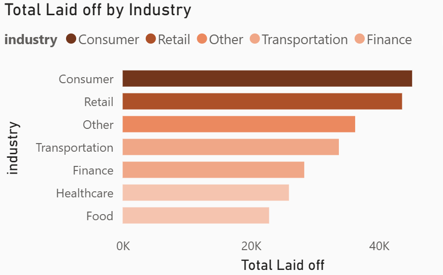
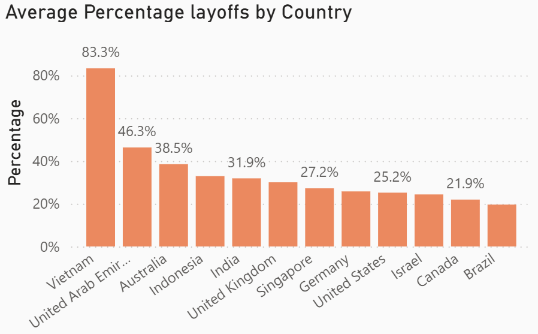
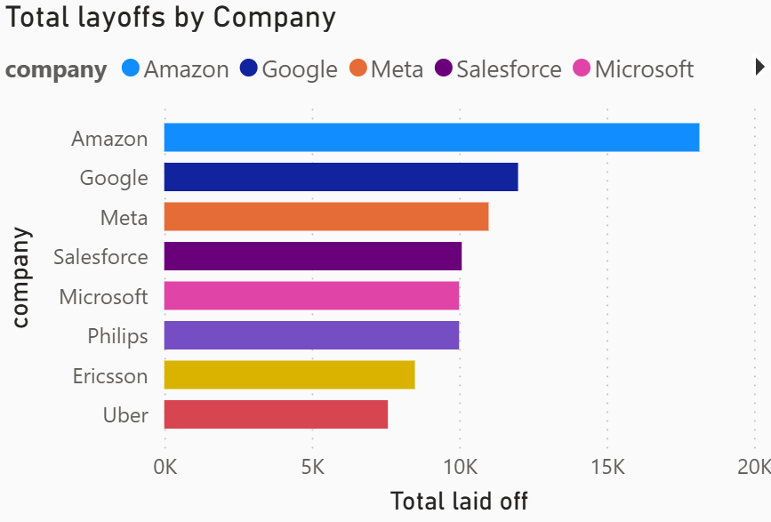
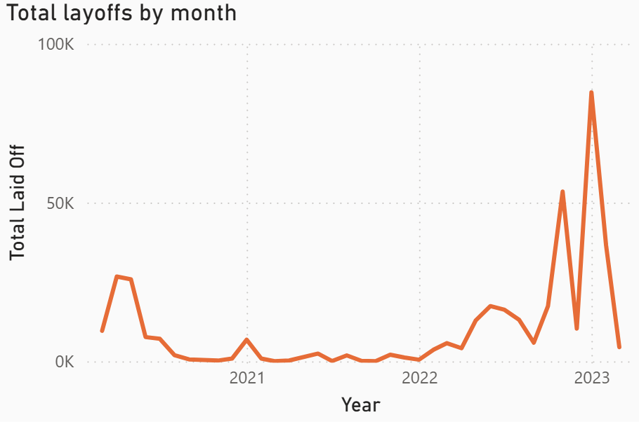

# 🌍 Global Layoffs Analysis (2020–2023)

> Exploratory data analysis of global workforce reductions across 1,995 companies to uncover industry trends, regional patterns, and the economic factors driving mass layoffs.


---

## 📌 Background

Between 2020 and 2023, the global workforce experienced significant transformation driven by COVID-19, rising inflation, and rapid technological shifts. Many companies — especially in the tech sector — entered a phase of aggressive hiring to meet surging pandemic-era demand.

However, this rapid expansion proved unsustainable. As economic conditions tightened in 2022, organizations across the globe began implementing large-scale layoffs, affecting hundreds of thousands of employees. The impact was not uniform, with certain industries and regions experiencing significantly higher job losses than others.

This project aims to answer:

- **Which industries** were most affected by layoffs?
- **How did layoffs evolve** over time from 2020 to 2023?
- **Which countries and companies** recorded the highest workforce reductions?
- **What key factors** ultimately triggered these large-scale layoffs?

---

## 📊 Dataset

| Info | Detail |
|---|---|
| Source | [Kaggle — Layoffs.fyi Dataset](https://www.kaggle.com/) |
| Data period | 2020 – 2023 |
| Total companies | 1,995 |
| Total employees laid off | ~384,000 |
| Key columns | `company`, `industry`, `total_laid_off`, `percentage_laid_off`, `country`, `stage`, `date`, `funds_raised` |

> 🔗 Dataset sourced from publicly available layoff tracking data. See `data/data_dictionary.md` for full column descriptions.

---

## 🛠️ Tools Used

| Tool | Purpose |
|---|---|
| **MySQL** | Data cleaning, preprocessing & exploratory data analysis |
| **Power BI** | Interactive dashboard & data visualization |
| **Canva** | Presentation storytelling & report design |

---

## 🧹 Data Cleaning Summary

Cleaning and preprocessing were performed using **MySQL** prior to visualization. Key steps included:

- Removed duplicate company entries
- Standardized date formats across all records
- Handled missing values in `total_laid_off` and `percentage_laid_off`
- Filtered out records with no layoff count (both fields null)
- Standardized country and industry naming conventions

> Full cleaning queries: [`cleaning/cleaning_queries.sql`](cleaning/cleaning_queries.sql)

---

## 🔍 Key Findings

### 1. Most Affected Industries

Consumer and Retail sectors recorded the highest total layoffs among all industries analyzed. These industries faced major operational adjustments as consumer behavior shifted after the pandemic. Technology-driven industries also experienced significant workforce reductions as growth projections were revised downward.



---

### 2. Countries with Highest Layoff Percentage

Layoffs affected countries differently. Vietnam and the United Arab Emirates recorded the highest average layoff percentages relative to company workforce size, reflecting the vulnerability of startup-heavy ecosystems to market slowdowns.



---

### 3. Companies with Largest Layoffs

Several global corporations recorded extremely high layoff numbers:

| Company | Notable for |
|---|---|
| **Amazon** | Highest total layoffs among all companies |
| **Google** | Large-scale workforce restructuring |
| **Meta** | Significant headcount reduction post-2022 |
| **Microsoft** | Operational efficiency restructuring |

Overhiring during the pandemic contributed heavily to this correction across all four companies.



---

### 4. Layoff Trend Over Time (2020–2023)

Layoffs evolved gradually between 2020 and 2021 before increasing sharply in 2022 and reaching a major peak in 2023. Significant spikes appeared in late 2022, with 2023 recording the highest monthly layoff numbers across the entire period.



---

## 💡 Main Factors Contributing to Layoffs

**1. Overhiring During COVID-19**
During the pandemic, companies aggressively increased hiring to support the rapid growth of digital services and remote work demand. As consumer behavior normalized post-pandemic, many organizations realized they had expanded beyond sustainable workforce capacity.

**2. Inflation & Rising Interest Rates**
Global inflation and increasing interest rates significantly raised operational and financing costs. Companies began reducing expenses and restructuring operations to maintain profitability and financial stability.

**3. Declining Consumer Demand**
After the post-pandemic economic slowdown, consumer spending weakened across several industries. Reduced demand forced companies to lower production, optimize operations, and decrease workforce size.

**4. Investor Pressure for Efficiency**
Investors increasingly prioritized profitability and operational efficiency over aggressive expansion. Large corporations shifted strategies toward cost reduction and long-term sustainability, directly triggering large-scale layoffs.

---

## 📝 Conclusion

Global layoffs increased significantly after 2022, affecting nearly **384,000 employees** across 1,995 companies in multiple industries and countries. Consumer, Retail, and Technology-related sectors experienced the highest workforce reductions, while large corporations dominated total layoff numbers.

Economic uncertainty, inflation, and post-pandemic market correction emerged as the primary drivers behind these layoffs. This project highlights how rapidly changing economic conditions can reshape global workforce strategies and business operations.

---

## 📁 Project Structure

```
global-layoffs-2020-2023/
├── README.md
├── .gitignore
│
├── data/
│   ├── layoffs_raw.csv                ← original dataset
│   ├── layoffs_clean.csv              ← cleaned dataset (exported from MySQL)
│   └── data_dictionary.md             ← column descriptions
│
├── cleaning/
│   ├── cleaning_queries.sql           ← MySQL cleaning queries
│   └── cleaning_log.md                ← step-by-step cleaning documentation
│
├── analysis/
│   └── Project 1 - Layoffs EDA.sql    ← MySQL EDA queries
│
└── reports/
    ├── figures/
    │   ├── layoffs_by_industry.png
    │   ├── layoffs_by_country.png
    │   ├── top_companies_layoffs.png
    │   └── layoff_trend_timeline.png
    ├── Global_Layoffs_Dashboard.pbix  ← Power BI dashboard file
    └── Global_Layoffs_2020_2023.pdf   ← full presentation deck
```

---

## 👤 Author

**Rafly Sean Antonio** — Data Analyst

[](https://linkedin.com/in/seanant)
[](mailto:rseanantonio@gmail.com)

---

*This project is part of a data analyst portfolio. Dataset sourced from publicly available layoff tracking records.*
